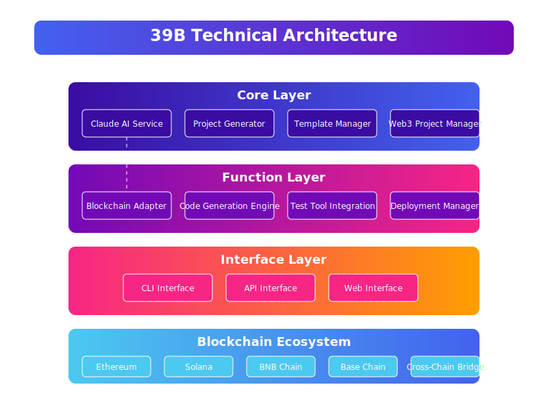
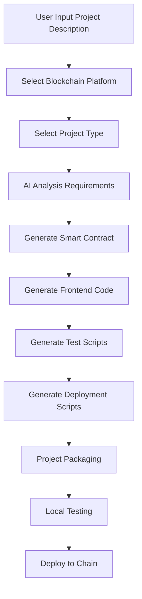

# 39b - AI-powered Web3 Project Development Framework

<div align="center">
  
  <h1>39b - Revolutionizing Web3 Development with AI</h1>
  <p>
    <a href="https://www.39b.fun/" target="_blank">Official Website</a> |
    <a href="https://x.com/39b_fun" target="_blank">Twitter</a> |
    <a href="https://github.com/39b-dev/39b" target="_blank">GitHub</a>
  </p>
</div>

## Project Overview

39b is an AI-powered Web3 project development framework designed to enable anyone to become a Web3 developer. By integrating Claude AI and pre-configured Web3 templates, users can generate complete Web3 projects directly from natural language descriptions, including smart contracts, frontend interfaces, and deployment scripts. The framework supports multiple blockchains and provides cross-chain interoperability capabilities.

Whether you're an experienced blockchain developer or a newcomer, 39b can help you quickly build, test, and deploy high-quality Web3 applications. Our mission is to lower the barrier to Web3 development and accelerate blockchain technology innovation and adoption.

## Current Development Status

The project is currently in active development with the following milestones:

- [x] Core AI integration with Claude API
- [x] Basic project generation framework
- [x] Support for Ethereum and Solana chains
- [x] Smart contract template library
- [x] CLI interface implementation
- [ ] Web interface development (In Progress)
- [ ] Cross-chain functionality (Planned)
- [ ] Advanced testing framework (Planned)
- [ ] Community template marketplace (Planned)

## Technical Architecture

39b adopts a modular, extensible architecture design, primarily consisting of the following core components:

<div align="center">
  
</div>

### Core Layer

- **Claude AI Service**: Handles natural language processing and code generation
- **Project Generator**: Creates complete project structures from templates and AI input
- **Template Manager**: Organizes and applies blockchain-specific project templates
- **Web3 Project Manager**: Orchestrates components and manages project lifecycle

### Function Layer

- **Blockchain Adapter**: Provides unified interfaces for different blockchains
- **Code Generation Engine**: Optimizes AI-generated code for production use
- **Test Tool Integration**: Generates comprehensive test suites
- **Deployment Manager**: Handles multi-chain deployment processes

### Interface Layer

- **CLI Interface**: Command-line tools for development workflow
- **API Interface**: Integration endpoints for third-party applications
- **Web Interface**: Browser-based project management (In Development)

## Workflow

39b's workflow is designed to be concise and intuitive, requiring only a few steps from project description to deployment:



1. **Requirement Analysis**: AI analyzes user's natural language description, extracts key requirements
2. **Code Generation**: Generates smart contracts and frontend code based on requirements and selected blockchain platform
3. **Testing & Validation**: Automatically generates test cases, verifies functionality
4. **Deployment Preparation**: Generates deployment scripts and configuration files
5. **Chain Deployment**: Assists users in deploying projects to target blockchain

## Core Features

- **AI-Assisted Development**: Integrates Claude API, generates code from natural language
- **Web3 Template Library**: Pre-configured smart contract and DApp frontend templates
- **Project Generator**: One-click generation of complete Web3 projects from descriptions
- **Deployment Toolchain**: Simplified Web3 project testing and deployment workflow
- **Multi-Chain Support**: Supports Ethereum, Solana, BNB Chain, and Base Chain
- **Cross-Chain Bridging**: Automatically generates cross-chain communication and asset transfer code
- **Blockchain Enhancer**: Provides blockchain-specific design patterns and best practices
- **Test Framework Integration**: Automatically generates test files and scripts
- **Deployment Script Generation**: Automatically generates deployment scripts and configurations

## Tech Stack

### Core Technologies

- **Programming Languages**: JavaScript, TypeScript, Solidity, Rust
- **Runtime Environment**: Node.js v16+
- **Package Management**: npm, yarn

### Frontend Technologies

- **Framework**: React v18, Next.js v13
- **UI Library**: TailwindCSS, shadcn/ui
- **Web3 Integration**:
  - **Ethereum Ecosystem**: wagmi v2, viem, ethers.js v6, web3.js v4
  - **Solana Ecosystem**: @solana/web3.js, @solana/wallet-adapter
  - **Universal Wallets**: RainbowKit, ConnectKit

### AI Technologies

- **Large Language Models**: Claude API (Anthropic), GPT-4 (OpenAI)
- **Code Generation**: Claude-3-Opus/Sonnet, GPT-Engineer
- **Prompt Engineering**: Blockchain-specific context injection, multi-round dialogue optimization

### Blockchain Technologies

- **Ethereum Ecosystem**:
  - **Development Framework**: Hardhat v2.19+, Truffle v5.9+, Foundry
  - **Testing Tools**: Mocha, Chai, Waffle
  - **Contract Libraries**: OpenZeppelin v5, solmate

- **Solana Ecosystem**:
  - **Development Framework**: Anchor v0.29+
  - **Toolchain**: Solana CLI, SPL Token
  - **NFT Support**: Metaplex

- **BNB Chain Ecosystem**:
  - **Development Tools**: BNB Chain SDK
  - **Test Network**: BNB Testnet

- **Base Chain Ecosystem**:
  - **Development Tools**: Base SDK
  - **Test Network**: Base Sepolia

- **Cross-Chain Technologies**:
  - **Bridge Protocols**: Axelar Network, LayerZero, Wormhole
  - **Cross-Chain Messaging**: CCIP, IBC

### Development Tools

- **Version Control**: Git, GitHub
- **CI/CD**: GitHub Actions
- **Documentation**: Markdown, Docusaurus
- **API Testing**: Postman, curl

## Quick Start

### Installation

```bash
# Install dependencies
npm install

# Set environment variables
echo "CLAUDE_API_KEY=your_api_key" > .env
```

### Using CLI Tool

```bash
# View help information
node src/cli/web3-project-cli.js

# Create new project (interactive)
node src/cli/web3-project-cli.js create

# Create specific project (command line parameters)
node src/cli/web3-project-cli.js create --name my-token --description "My ERC20 Token" --blockchain ethereum --type token

# List supported blockchains
node src/cli/web3-project-cli.js list-blockchains

# List test frameworks supported by specific blockchain
node src/cli/web3-project-cli.js list-test-frameworks --blockchain ethereum
```

### Run Demo

```bash
# Run demo script
node src/demo/web3-project-demo.js
```

## Project Structure

```
39b/
├── src/                      # Source code directory
│   ├── cli/                  # Command line interface tools
│   │   └── web3-project-cli.js  # Main CLI implementation
│   ├── core/                 # Core framework components
│   │   ├── claude.js         # Claude AI integration service
│   │   ├── projectGenerator.js # Project generation engine
│   │   ├── templateManager.js # Template management system
│   │   └── web3ProjectManager.js # Project lifecycle manager
│   ├── demo/                 # Example implementations
│   │   ├── web3-project-demo.js # Basic usage demo
│   │   └── enhanced-claude-api-demo.js # AI integration demo
│   ├── templates/            # Project templates
│   │   ├── contracts/       # Smart contract templates
│   │   ├── frontend/        # UI component templates
│   │   └── projects/        # Full project templates
│   └── utils/                # Utility functions
│       ├── blockchainEnhancer.js # Chain-specific optimizations
│       └── claudeEnhancer.js # AI prompt engineering tools
├── test/                     # Test files
├── docs/                     # Documentation
└── scripts/                  # Build and deployment scripts
```

## Usage

### As a Developer

```javascript
const Web3ProjectManager = require('./src/core/web3ProjectManager');

// Create project manager
const projectManager = new Web3ProjectManager({
  apiKey: process.env.CLAUDE_API_KEY,
  outputDir: './output',
  defaultBlockchain: 'ethereum',
  useGptEngineer: true,
  multiChainSupport: true
});

// Initialize project manager
await projectManager.initialize();

// Generate project
const result = await projectManager.generateProject(
  'my-project',
  'An ERC20 token project with minting and burning capabilities',
  {
    blockchain: 'ethereum',
    projectType: 'token',
    testFramework: 'hardhat'
  }
);

console.log(`Project generated at: ${result.outputDir}`);
```

### Using CLI

1. Describe your project concept
2. Choose appropriate tech stack (blockchain, project type, test framework)
3. Use CLI tool to generate project
4. Test and deploy to target blockchain

## Advanced Features

### Multi-Chain Support

The framework supports integrating multiple blockchains in one project, currently including Ethereum, Solana, BNB Chain, and Base Chain:

```javascript
const result = await projectManager.generateProject(
  'multi-chain-dapp',
  'A multi-chain DApp supporting Ethereum, BNB Chain, and Base Chain',
  {
    blockchain: 'ethereum',
    projectType: 'dapp',
    additionalBlockchains: ['bnbchain', 'base']
  }
);
```

### Blockchain Enhancer

The blockchain enhancer provides blockchain-specific design patterns and best practices to generate high-quality smart contracts:

- Security Mode
- Optimization Techniques
- Design Pattern Library
- Error Handling Mechanism
- Cross-chain Compatibility Mode

### Test Framework Integration

Automatically generates test files and scripts, supporting:

- **Ethereum**: Hardhat, Truffle
- **Solana**: Anchor
- **BNB Chain**: Hardhat, BNB Chain Test Framework
- **Base Chain**: Hardhat, Foundry

### Cross-chain Bridging

Automatically generates cross-chain bridging code to support communication and asset transfer between different blockchains:

```javascript
// Add multi-chain support and bridging functionality
await projectManager.addMultiChainSupport(
  './my-project',
  'ethereum',
  ['bnbchain', 'base']
);
```

Generated bridging code supports:
- Cross-chain asset transfer
- Cross-chain message passing
- Cross-chain state synchronization
- Multi-chain identity verification

## Enhanced Claude API Features

### Enhanced Claude API Call

The new `enhancedCallClaudeAPI` method provides various advanced features, including:

- Streamed Response Processing
- Multi-modal Input Support
- Advanced Response Validation
- Blockchain-specific Context Injection
- Smart Contract Optimization Suggestions
- Cross-chain Compatibility Check

### Usage Example

```javascript
const ClaudeService = require('./src/core/claude');

// Initialize Claude service
const claudeService = new ClaudeService({
  apiKey: process.env.CLAUDE_API_KEY,
  model: 'claude-3-opus-20240229',
  maxTokens: 4000
});

// Basic call
const response = await claudeService.enhancedCallClaudeAPI(
  'Create a simple ERC20 token contract for Ethereum',
  {
    extractCode: true,
    blockchainContext: 'ethereum'
  }
);

console.log('Generated code:', response.code);

// Streamed response example
const streamResponse = await claudeService.enhancedCallClaudeAPI(
  'Create a SPL token contract for Solana',
  {
    streamResponse: true,
    blockchainContext: 'solana',
    extractCode: true,
    onStreamUpdate: (chunk) => console.log('New block received:', chunk)
  }
);

// Multi-modal input example
const multiModalResponse = await claudeService.enhancedCallClaudeAPI(
  {
    content: [
      { type: 'text', text: 'Analyze the security issues in this smart contract' },
      { type: 'image', source: { type: 'base64', media_type: 'image/png', data: '...' } }
    ]
  },
  {
    multiModal: true,
    blockchainContext: 'ethereum'
  }
);
```

### API Reference

```javascript
/**
 * Enhanced Claude API Call Method V2
 * Integrates streamed response, multi-modal input, response validation, etc. advanced features
 * @param {string|Object} input - Prompt or multi-modal input object sent to Claude
 * @param {Object} options - Call options
 * @returns {Promise<Object>} - Claude's response and metadata
 */
async enhancedCallClaudeAPI(input, options = {}) {
  // Default options
  const defaultOptions = {
    // Basic options
    maxTokens: this.config.maxTokens,
    temperature: this.config.temperature,
    model: this.config.model,
    systemPrompt: null,
    
    // Enhanced features options
    streamResponse: false,
    validateResponse: false,
    validationCriteria: {},
    multiModal: false,
    extractMetadata: false,
    
    // Code processing options
    extractCode: false,
    useAdvancedCodeExtraction: false,
    codeExtractionOptions: {},
    
    // Context management
    retainContext: false,
    contextWindow: [],
    
    // Domain knowledge
    enhancePrompt: true,
    domainSpecificKnowledge: {},
    blockchainContext: null,
    
    // Error handling
    maxRetries: this.config.maxRetries,
    retryDelay: this.config.retryDelay,
    
    // Callback functions
    onStreamStart: null,
    onStreamUpdate: null,
    onStreamComplete: null,
    onStreamError: null
  };
  
  // Return result example
  return {
    text: "Response Text",
    metadata: { /* Metadata */ },
    code: "Extracted Code",
    validation: { valid: true, details: [] }
  };
}
```

## Advanced Error Handling

The framework provides comprehensive error handling mechanisms, including:

- Smart contract interaction error handling
- Blockchain network connection issue recovery
- API call failure retry strategy
- Detailed error logs and diagnostic information

## Environment Variables

- `CLAUDE_API_KEY`: Claude AI API key (required)

## Contribution Guidelines

1. Fork repository
2. Create feature branch (`git checkout -b feature/amazing-feature`)
3. Commit changes (`git commit -m 'Add some amazing feature'`)
4. Push to branch (`git push origin feature/amazing-feature`)
5. Create Pull Request

## Operation Logic

39b adopts an open source community-driven development mode, combining commercial support services:

### Open Source Community

- **Core Framework**: Fully open source, MIT license
- **Community Contributions**: Welcome feature requests, error reports, and code contributions
- **Plugin Ecosystem**: Supports third-party developers to create and share plugins

### Commercial Services

- **Enterprise Edition**: Provides additional enterprise-level features and support
- **Custom Development**: Customized solutions for specific needs
- **Technical Consulting**: Web3 project architecture and development consulting

### User Groups

- **Web3 Developers**: Accelerate development process, improve code quality
- **Blockchain Entrepreneurs**: Quickly turn ideas into working prototypes
- **Traditional Developers**: Lower the barrier to entering Web3
- **Educational Institutions**: As a blockchain teaching and research tool

## Project Progress

### Current Status

- **Version**: v0.1.0-alpha
- **Release Date**: March 2025
- **Development Stage**: Alpha Test

### Completed Features

- ✅ Claude API Integration and Enhancement
- ✅ Basic Project Generation Framework
- ✅ Ethereum and Solana Support
- ✅ Basic CLI Tools
- ✅ Core Documentation

### In Progress

- 🔄 BNB Chain and Base Chain Full Support
- 🔄 Cross-chain Bridging Function
- 🔄 Test Framework Integration
- 🔄 Advanced Error Handling

### Roadmap

- 📅 **Q2 2025**: Beta Release, Complete Multi-chain Support
- 📅 **Q3 2025**: Web Interface, Plugin System
- 📅 **Q4 2025**: v1.0 Official Release, Enterprise Edition
- 📅 **2026**: Advanced AI Features, More Blockchain Support

## Community and Support

- **GitHub Issues**: For bug reports and feature requests
- **Twitter**: Follow [@39b_fun](https://x.com/39b_fun) for updates
- **Email**: support@39b.fun

## Used Open Source Libraries

### Core Dependencies

- **[anthropic](https://github.com/anthropics/anthropic-sdk-typescript)** - Official TypeScript/JavaScript SDK for Claude AI API
- **[commander](https://github.com/tj/commander.js)** - Complete Node.js command line solution
- **[dotenv](https://github.com/motdotla/dotenv)** - Loads environment variables from .env file
- **[axios](https://github.com/axios/axios)** - Promise-based HTTP client
- **[lodash](https://github.com/lodash/lodash)** - Useful JavaScript utility library

### Blockchain Related

#### Ethereum

- **[ethers](https://github.com/ethers-io/ethers.js)** - Complete Ethereum library and wallet implementation
- **[web3.js](https://github.com/web3/web3.js)** - Ethereum JavaScript API
- **[hardhat](https://github.com/NomicFoundation/hardhat)** - Ethereum development environment
- **[truffle](https://github.com/trufflesuite/truffle)** - Ethereum smart contract development framework
- **[wagmi](https://github.com/wagmi-dev/wagmi)** - React Hooks for Ethereum
- **[viem](https://github.com/wagmi-dev/viem)** - Ethereum TypeScript interface

#### Solana

- **[solana-web3.js](https://github.com/solana-labs/solana-web3.js)** - Solana JavaScript API
- **[anchor](https://github.com/coral-xyz/anchor)** - Solana smart contract framework
- **[metaplex](https://github.com/metaplex-foundation/js)** - Solana NFT standard JavaScript SDK

#### Cross-chain

- **[axelar-sdk](https://github.com/axelarnetwork/axelarjs-sdk)** - Axelar Network JavaScript SDK
- **[layerzero-sdk](https://github.com/LayerZero-Labs/sdk)** - LayerZero cross-chain message passing SDK
- **[wormhole-sdk](https://github.com/wormhole-foundation/wormhole)** - Wormhole cross-chain bridging SDK

### Frontend

- **[react](https://github.com/facebook/react)** - JavaScript library for building user interfaces
- **[next.js](https://github.com/vercel/next.js)** - React framework
- **[tailwindcss](https://github.com/tailwindlabs/tailwindcss)** - Utility-first CSS framework
- **[shadcn/ui](https://github.com/shadcn-ui/ui)** - Reusable UI components

### Development Tools

- **[typescript](https://github.com/microsoft/TypeScript)** - JavaScript superset
- **[jest](https://github.com/facebook/jest)** - JavaScript test framework
- **[eslint](https://github.com/eslint/eslint)** - Plugable JavaScript code checking tool
- **[prettier](https://github.com/prettier/prettier)** - Code formatting tool

## License

This project is licensed under the MIT License - see the [LICENSE](LICENSE) file for details.

Copyright (c) 2024 39b Development Team

Permission is hereby granted, free of charge, to any person obtaining a copy
of this software and associated documentation files (the "Software"), to deal
in the Software without restriction, including without limitation the rights
to use, copy, modify, merge, publish, distribute, sublicense, and/or sell
copies of the Software, and to permit persons to whom the Software is
furnished to do so, subject to the following conditions:

The above copyright notice and this permission notice shall be included in all
copies or substantial portions of the Software.

THE SOFTWARE IS PROVIDED "AS IS", WITHOUT WARRANTY OF ANY KIND, EXPRESS OR
IMPLIED, INCLUDING BUT NOT LIMITED TO THE WARRANTIES OF MERCHANTABILITY,
FITNESS FOR A PARTICULAR PURPOSE AND NONINFRINGEMENT. IN NO EVENT SHALL THE
AUTHORS OR COPYRIGHT HOLDERS BE LIABLE FOR ANY CLAIM, DAMAGES OR OTHER
LIABILITY, WHETHER IN AN ACTION OF CONTRACT, TORT OR OTHERWISE, ARISING FROM,
OUT OF OR IN CONNECTION WITH THE SOFTWARE OR THE USE OR OTHER DEALINGS IN THE
SOFTWARE.
